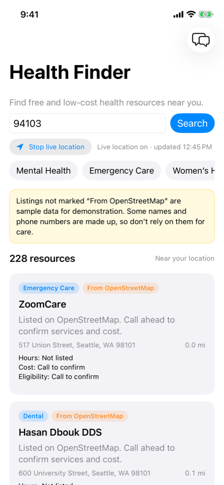

# Health Finder for iPhone

A SwiftUI app with the same features as the website: ZIP search, live location, category filters, the resource helper chat, and 911/988 links. It gets its data from the website's API, so the web app needs to be running.

Requires Xcode 16 or later. The app runs on iOS 17 and later.



## Run it in the simulator

1. Start the web app from the project root: `npm run dev`
2. Open `ios/CommunityHealthFinder.xcodeproj` in Xcode.
3. Pick an iPhone simulator at the top of the window and press **Run** (⌘R).

The app asks for location access when it starts. To pretend to be somewhere else in the simulator, use **Features → Location** in the Simulator menu.

## Run it on your iPhone

1. In Xcode, select the **CommunityHealthFinder** target, open **Signing & Capabilities**, and choose your Apple ID under **Team**. If Xcode says the bundle identifier is taken, change `com.example.CommunityHealthFinder` to something unique, such as `com.yourname.CommunityHealthFinder`.
2. Point the app at a server your phone can reach (see below), since `localhost` on a phone means the phone itself.
3. Connect your iPhone, select it at the top of the window, and press **Run**. The first time, your phone may ask you to trust the developer in **Settings → General → VPN & Device Management**.

## Point it at a different server

The server address is the `API_BASE_URL` build setting, which defaults to `http://localhost:3000`. To change it, select the target, open **Build Settings**, search for `API_BASE_URL`, and set it to:

- your deployed website, e.g. `https://your-app.vercel.app`, or
- your Mac on the same Wi-Fi network, e.g. `http://192.168.1.20:3000` (`npm run dev` prints this as the "Network" address).

## How it's organized

```
CommunityHealthFinder/
  CommunityHealthFinderApp.swift   App entry point
  ContentView.swift                Search screen
  Views/                           Resource cards, notices, chat sheet
  Services/                        API calls, search, chat, and location
  Models/                          API response types and categories
  PreviewData.swift                Sample listings for SwiftUI previews
```

New Swift files added to `CommunityHealthFinder/` are picked up by the project automatically.
